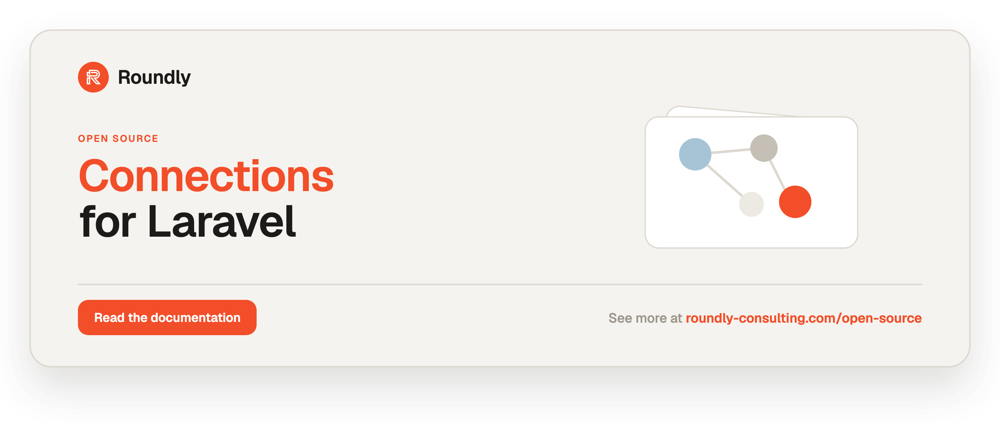

<!-- roundly-hero:start -->
<p align="center">
  <a href="https://roundly-consulting.com/open-source/docs/connections-for-laravel?utm_source=github&utm_medium=readme&utm_campaign=open-source&utm_content=connections-for-laravel">
    
  </a>
</p>
<!-- roundly-hero:end -->

<!-- roundly-badges:start -->
<p align="center">
  <a href="https://packagist.org/packages/roundly-consulting/connections-for-laravel"></a>
  <a href="https://github.com/roundly-consulting/connections-for-laravel/actions/workflows/run-tests.yml"></a>
  <a href="https://github.com/roundly-consulting/connections-for-laravel/actions/workflows/fix-php-code-style-issues.yml"></a>
  <a href="https://donate.stripe.com/dRmeVe8FX5PF1Qd9pXcEw00"></a>
  <a href="https://www.patreon.com/cw/roundly"></a>
  <a href="https://roundly-consulting.com/support-us?utm_source=github&utm_medium=readme&utm_campaign=open-source&utm_content=connections-for-laravel#crypto"></a>
</p>
<!-- roundly-badges:end -->

# Connections for Laravel

Many-to-many connections between Eloquent models, with per-connection **permissions** and
optional **expirations**. Connect any model to any other model — a user to a team, an
organization to a project — record what the connection is allowed to do, and let expired
connections prune themselves.

A fluent `Connections` facade, expressive trait verbs, lifecycle actions, events, and a
prune command make the common operations — connect, disconnect, grant, revoke, sync, check —
one readable line each. Connections can also model **invitation flows** (pending → accepted /
blocked), carry free-form **metadata**, be operated on in **bulk**, and matched with
**wildcard permissions** and **query scopes**.

> **Access checks require an active connection** — accepted and not expired — by default
> (`connections.enforce_active_on_check`). An expired or non-accepted connection grants no
> permission. Set the flag to `false` to treat status and expiry as advisory, so any stored
> connection counts.

## Requirements

- PHP 8.4+
- Laravel 12 or 13

## Installation

Install the package via Composer:

```bash
composer require roundly-consulting/connections-for-laravel
```

Publish and run the migration. The package **does not load its migration automatically** — it is
copied into your `database/migrations` (timestamped) when you publish it, so your app owns it and
`php artisan migrate` runs exactly what you published:

```bash
php artisan vendor:publish --tag="connections-migrations"
php artisan migrate
```

Optionally publish the config file:

```bash
php artisan vendor:publish --tag="connections-config"
```

## Configuration

The package works with zero configuration. Publish `config/connections.php` to override any
of the keys below.

```php
return [

    // The Eloquent model used to represent a connection. Swap it for your own
    // subclass of RoundlyConsulting\Connections\Models\Connection to extend behaviour.
    'model' => RoundlyConsulting\Connections\Models\Connection::class,

    // The database table that stores connections. The migration reads this value.
    'table' => env('CONNECTIONS_TABLE', 'connections'),

    // Key type of the connector / connectable morph columns: bigint, uuid or ulid.
    // Read by the migration — choose it before you publish and run it.
    'key_type' => env('CONNECTIONS_KEY_TYPE', 'bigint'),

    // In-request memoisation of resolved connections. Writes invalidate it automatically,
    // and it is dropped at the start of every request / queued job (Octane included).
    'cache' => [
        'enabled' => env('CONNECTIONS_CACHE_ENABLED', true),
    ],

    // Dispatch lifecycle events as connections change.
    'events' => [
        'enabled' => env('CONNECTIONS_EVENTS_ENABLED', true),
    ],

    // Register a Gate::before check so $user->can('permission', $connectable) works.
    'register_gate' => env('CONNECTIONS_REGISTER_GATE', false),

    // Permissions applied to a new connection when the caller supplies none.
    'default_permissions' => [],

    // Status a connection is created with when none is given (pending|accepted|blocked).
    'default_status' => env('CONNECTIONS_DEFAULT_STATUS', 'accepted'),

    // When true, access checks only count active (accepted + not expired) connections.
    'enforce_active_on_check' => env('CONNECTIONS_ENFORCE_ACTIVE_ON_CHECK', true),

    // Default expiry for new connections: a relative string ("30 days") or seconds.
    'expiry' => [
        'default' => env('CONNECTIONS_EXPIRY_DEFAULT'),
    ],

];
```

| Key                       | Type            | Default             | Env                                | Purpose |
|---------------------------|-----------------|---------------------|------------------------------------|---------|
| `model`                   | `class-string`  | `Connection::class` | —                                  | Model class used when reading and writing connections. |
| `table`                   | `string`        | `connections`       | `CONNECTIONS_TABLE`                | Table that stores connections; read by the migration. |
| `key_type`                | `string`        | `bigint`            | `CONNECTIONS_KEY_TYPE`             | Key type of the polymorphic `connector` / `connectable` columns: `bigint`, `uuid` or `ulid` (anything else throws `InvalidConfigurationException`). Read by the migration, so set it before migrating. |
| `cache.enabled`           | `bool`          | `true`              | `CONNECTIONS_CACHE_ENABLED`        | In-request connection cache, scoped to one request / queued job. Disable to always re-query. |
| `events.enabled`          | `bool`          | `true`              | `CONNECTIONS_EVENTS_ENABLED`       | Dispatch lifecycle events. |
| `register_gate`           | `bool`          | `false`             | `CONNECTIONS_REGISTER_GATE`        | Fall a host `Gate` check through to connection permissions. |
| `default_permissions`     | `list<string>`  | `[]`                | —                                  | Permissions applied when a connection is created with none. An explicit empty set stays empty. |
| `default_status`          | `string`        | `accepted`          | `CONNECTIONS_DEFAULT_STATUS`       | Status new connections start in (`pending`/`accepted`/`blocked`); anything else throws `InvalidConfigurationException`. |
| `enforce_active_on_check` | `bool`          | `true`              | `CONNECTIONS_ENFORCE_ACTIVE_ON_CHECK` | Require accepted + not-expired for access checks. `false` = status and expiry are advisory; any stored connection counts. |
| `expiry.default`          | `string\|int\|null` | `null`          | `CONNECTIONS_EXPIRY_DEFAULT`       | Default expiry applied when none is given. |

Boolean keys read env strings the usual way: `true`/`1`/`on`/`yes` switch a flag on,
`false`/`0`/`off`/`no` switch it off, and anything else (a typo such as `=disabled`) throws
`InvalidConfigurationException` instead of quietly reading as the default. `expiry.default` takes
a relative string (`"30 days"`) or seconds — an integer, or a numeric env string such as
`CONNECTIONS_EXPIRY_DEFAULT=3600`. It applies to new connections only.

## Usage

### Make a model connectable

Add the `HasConnections` trait and implement the `Connectable` contract on any model that
should take part in connections:

```php
use Illuminate\Database\Eloquent\Model;
use RoundlyConsulting\Connections\Concerns\HasConnections;
use RoundlyConsulting\Connections\Contracts\Connectable;

class User extends Model implements Connectable
{
    use HasConnections;
}

class Team extends Model implements Connectable
{
    use HasConnections;
}
```

A model can be both a **connector** (the side that initiates a connection) and a
**connectable** (the side a connection points to).

### The `Connections` facade

The `Connections` facade is the package's public API. Every operation is reachable from it:

| Method | Returns | Purpose |
|---|---|---|
| `Connections::between($connector, $connectable)` | `PendingConnection` | Fluent builder for one pair |
| `Connections::from($connector)` | `PendingConnection` | Builder with the connectable set later (`to()`, `toMany()`) or a `sync()` reconcile |
| `Connections::expiring(int $days = 7)` | `Builder<Connection>` | Every live connection expiring within the window |
| `Connections::prune()` | `int` | Soft-delete expired connections, returning the count |
| `Connections::flushCache()` | `void` | Drop the in-request permission cache |
| `Connections::fake()` | `ConnectionFake` | Recording fake for tests (see **Testing helper**) |

```php
use RoundlyConsulting\Connections\DataTransferObjects\SyncTarget;
use RoundlyConsulting\Connections\Facades\Connections;

// Create the connection, or update the pair's existing one, with permissions and an expiry.
Connections::between($user, $team)
    ->withPermissions('view', 'edit')
    ->expiresIn(now()->addMonth())   // CarbonInterface, CarbonInterval, or seconds
    ->connect();

// Defer the connectable until later with from()->to().
Connections::from($user)->to($team)->withPermissions('view')->connect();

// Move the expiry, or clear it with null.
Connections::between($user, $team)->extend(now()->addYear());
Connections::between($user, $team)->extend(null);

// Look the pair up.
Connections::between($user, $team)->exists();   // bool — an active connection exists
Connections::between($user, $team)->find();     // ?Connection — in any status

// Remove the connection (soft delete).
Connections::between($user, $team)->disconnect();

// Reconcile a connector to exactly this set (connect missing, disconnect extras).
Connections::from($user)->sync([$teamA, new SyncTarget($teamB, permissions: ['read'])]); // SyncResult

// Connections expiring within 14 days, across every connector.
Connections::expiring(14)->with('connector')->get();

// Remove all expired connections, returning how many were removed.
$removed = Connections::prune();

// Drop the in-request permission cache mid-request (it already resets per request / job).
Connections::flushCache();
```

**Re-connecting is safe.** A pair has at most one connection row, and `connect()` on a pair that
already has one only changes what you pass: its status, permissions, expiry and meta are kept
unless restated (meta is merged — see **Connection metadata**), and config defaults
(`default_permissions`, `default_status`, `expiry.default`) apply to new connections only. To
clear an expiry use `extend(null)`. After a `disconnect()` or a prune, `connect()` (and `grant()`,
`permissions()->sync()`, `invite()`, `toggle()`, `sync()`) revives the pair as a **fresh**
connection — except a blocked one, which stays blocked (see **Invitations**).

### Permissions on a pair — `permissions()`

`between()->permissions()` is the permission set of one connection:

```php
$permissions = Connections::between($user, $team)->permissions();

$permissions->grant('publish');          // Connection — creates the connection if absent
$permissions->revoke('publish');         // Connection — throws ConnectionNotFound if absent
$permissions->sync('view', 'edit');      // Connection — exact set, creates if absent
$permissions->clear();                   // Connection — remove every permission; throws ConnectionNotFound if absent

$permissions->all();                     // Collection<int, string> — what is stored
$permissions->has('edit');               // bool
$permissions->hasAny('view', 'edit');    // bool
$permissions->hasAll('view', 'edit');    // bool
```

`has()`, `hasAny()` and `hasAll()` honour wildcards and, while `enforce_active_on_check` is on,
only count an active connection. The cache is invalidated automatically on every write, so a
check after a write reflects the change without any `force` flag.

### Without the facade

The facade is sugar over `RoundlyConsulting\Connections\ConnectionManager`, a container
singleton. Inject it for the same API, or call an action directly for the raw use case — all
three run the same code:

```php
use RoundlyConsulting\Connections\Actions\GrantPermissions;
use RoundlyConsulting\Connections\ConnectionManager;

final class ShareTeam
{
    public function __construct(private ConnectionManager $connections) {}

    public function __invoke(User $user, Team $team): void
    {
        $this->connections->between($user, $team)->permissions()->grant('view');
    }
}

// The raw action.
app(GrantPermissions::class)->execute($user, $team, 'view');
```

### Trait verbs

If you prefer model methods, `HasConnections` exposes the same lifecycle. Every write goes
through the `ConnectionManager`, so host overrides and `Connections::fake()` see trait calls
too:

```php
$user->connectTo($team, ['view', 'edit'], now()->addMonth()); // Connection
$user->disconnectFrom($team);                                  // void
$user->grantThroughConnection($team, 'publish');               // Connection
$user->revokeThroughConnection($team, 'publish');              // Connection
$user->syncConnectionPermissions($team, ['view']);             // Connection
$user->clearConnectionPermissions($team);                      // Connection
$user->permissionsThroughConnection($team);                    // Collection<int, string>
$user->syncConnections([$teamA, $teamB]);                      // SyncResult
```

### Invitations (pending → accepted / blocked)

Model an approval flow by creating a connection in the `pending` state and letting the
receiving side accept or block it:

```php
// Connector side: send an invitation (a pending connection).
Connections::between($user, $team)->withPermissions('view')->invite();

// Receiving side accepts or blocks.
$team->acceptConnectionFrom($user);  // status → accepted (now active)
$team->blockConnectionFrom($user);   // status → blocked (grants nothing)

// Or drive it from the connector / builder.
Connections::between($user, $team)->accept();
Connections::between($user, $team)->block();
$user->inviteConnection($team);

// Model helpers.
$connection->isPending();
$connection->isAccepted();
$connection->isBlocked();
$connection->isActive();   // accepted AND not expired
```

Only **active** connections grant permissions and count for `isConnectedTo` while
`enforce_active_on_check` is on (the default).

Status only moves the way `ConnectionStatus::canTransitionTo()` allows, and every action enforces
it:

- `connect()`, `toggle()`, `connectAll()` and `sync()` never change an existing connection's
  status — re-connecting cannot self-accept a pending invitation, demote an accepted one, or
  lift a block.
- `invite()` over a pending invitation is fine; over an accepted or blocked connection it throws
  `RoundlyConsulting\Connections\Exceptions\InvalidStatusTransition`.
- A block is lifted only by an explicit `accept()` (`$team->acceptConnectionFrom($user)`). It
  also survives `disconnect()` and `connections:prune`: re-connecting a soft-deleted blocked pair
  restores it **still blocked** (firing `ConnectionRestored`).

### Connection metadata

Attach free-form context to a connection with a JSON `meta` bag:

```php
Connections::between($user, $team)
    ->withMeta(['invited_by' => $admin->id, 'role' => ['label' => 'owner']])
    ->connect();

$connection->meta('role.label');           // 'owner' (dot access)
$connection->meta('missing', 'fallback');  // 'fallback'

// Re-connecting merges meta by default; replaceMeta() overwrites instead.
Connections::between($user, $team)->withMeta(['note' => 'hi'])->connect();          // merge; perms + expiry kept
Connections::between($user, $team)->withMeta(['note' => 'hi'])->replaceMeta()->connect();

// The trait verb takes meta too.
$user->connectTo($team, ['view'], now()->addMonth(), ['source' => 'import']);
```

### Bulk operations

Operate on many connectables at once, or reconcile an exact set:

```php
// Touch many targets in one call (each still emits its own event).
Connections::from($user)->toMany([$teamA, $teamB])->withPermissions('view')->connectAll();
Connections::from($user)->toMany($teams)->disconnectAll();
Connections::from($user)->toMany($teams)->grantAll('publish');
Connections::from($user)->toMany($teams)->revokeAll('publish'); // any status: pending, blocked, expired

// Reconcile to exactly this set: connect missing, disconnect extras, update overlap.
// Safe to repeat — a target detached earlier is revived, not re-inserted.
$result = Connections::from($user)->sync([$teamA, $teamC]);   // or $user->syncConnections([...])
$result->attached;  // list of newly connected (or revived) ids
$result->detached;  // list of disconnected ids
$result->updated;   // list of ids that already existed

// Per-target permissions, expiry or meta through SyncTarget DTOs. On an overlap, only what the
// target states changes: a plain model (or a null field) keeps the stored value, and the
// status is never touched.
use RoundlyConsulting\Connections\DataTransferObjects\SyncTarget;

Connections::from($user)->sync([
    new SyncTarget($teamA, permissions: ['view', 'edit']),
    new SyncTarget($teamB, ['publish'], now()->addDays(30)),
]);
```

### Toggle, reconnect & restore

```php
// Disconnect an active connection, otherwise connect — as often as you like. Over a pending,
// blocked or expired row the "connect" keeps that status and expiry (it never lifts a block
// or renews an expiry — use accept() / extend() for that).
Connections::between($user, $team)->toggle();   // ?Connection
$user->toggleConnection($team);

// Restore a previously soft-deleted connection with the permissions, expiry and meta it had
// (connect() would start it fresh), firing ConnectionRestored — or connect afresh if none trashed.
Connections::between($user, $team)->reconnect();
Connections::between($user, $team)->restore();  // alias
$user->reconnectTo($team);
```

### Inspecting connections

```php
$user->isConnectedTo($team);                       // bool
$user->isConnectedToAny($team->getMorphClass());   // bool
$team->hasConnector($user);                        // bool
$team->hasConnectorFromAny($user->getMorphClass());// bool

$user->connections;  // connections this model initiated
$team->connectors;   // connections pointing at this model
```

### Checking permissions

```php
$user->hasPermissionThroughConnection($team, 'edit');             // bool
$user->hasPermissionThroughConnection($team, 'edit', force: true);// bypass the cache
$user->hasAnyPermissionThroughConnection($team, 'view', 'edit');  // bool
$user->hasAllPermissionsThroughConnection($team, 'view', 'edit'); // bool

$connection->hasPermission('edit');             // bool on a Connection
$connection->hasAnyPermission('view', 'edit');  // bool
$connection->hasAllPermissions('view', 'edit'); // bool

// The same checks through the facade.
Connections::between($user, $team)->permissions()->has('edit');

// Clear every permission on a connection.
Connections::between($user, $team)->permissions()->clear();
$user->clearConnectionPermissions($team);
```

#### Wildcard permissions

A connection whose permission set contains `*` passes any permission check, and a segment
wildcard like `posts.*` matches `posts.edit`. Sets without a wildcard behave exactly as before
(this is purely opt-in by the stored data).

```php
Connections::between($user, $team)->withPermissions('posts.*')->connect();
$user->hasPermissionThroughConnection($team, 'posts.edit');  // true
$user->hasPermissionThroughConnection($team, 'users.edit');  // false
```

### Query scopes & typed fetches

```php
// Constrained relations (return MorphMany you can chain ->get()/->count()).
$user->activeConnections();                 // accepted + not expired
$user->expiredConnections();                // past expiry
$user->expiringConnections($days = 7);      // expiring within N days
$user->connectionsWithPermission('publish'); // honours '*' / 'posts.*'; active only while enforced

// Eloquent scopes on the model / relation.
$user->connections()->active()->get();
$user->connections()->expiringSoon(14)->get();
$user->connections()->withPermission('posts.edit')->get(); // exact, '*', 'posts.*' — any status

// Across every connector.
Connections::expiring(14)->get();

// Fetch the connected models of a given type (FQCN or morph alias), not the Connection rows.
// Like isConnectedTo() / hasConnector(), only active links count while enforce_active_on_check is on.
$user->connectablesOfType(Team::class);   // Collection<Team>
$team->connectorsOfType(User::class);     // Collection<User>
```

The `withPermission` scope matches the exact permission, `*` and trailing segment wildcards
(`posts.*`, `posts.comments.*`); any other pattern shape (e.g. `posts.*.edit`) is honoured by
`hasPermission()` / `hasPermissionThroughConnection()` only.

### Actions

Each operation is also a standalone action you can resolve from the container and unit test.
`CreateConnection::execute()` takes the two models plus optional permissions, expiry, status
and meta; `executeData()` takes the same input as a `ConnectionData` DTO.

```php
use RoundlyConsulting\Connections\Actions\CreateConnection;
use RoundlyConsulting\Connections\Actions\GrantPermissions;
use RoundlyConsulting\Connections\Actions\RevokePermissions;
use RoundlyConsulting\Connections\Actions\SyncPermissions;
use RoundlyConsulting\Connections\Actions\ClearPermissions;
use RoundlyConsulting\Connections\Actions\ExtendConnection;
use RoundlyConsulting\Connections\Actions\DisconnectConnection;
use RoundlyConsulting\Connections\Actions\PruneConnections;
use RoundlyConsulting\Connections\Actions\SyncConnections;
use RoundlyConsulting\Connections\DataTransferObjects\SyncTarget;

app(CreateConnection::class)->execute($user, $team, collect(['view']), now()->addMonth());
app(GrantPermissions::class)->execute($user, $team, 'publish');
app(RevokePermissions::class)->execute($user, $team, 'publish');
app(SyncPermissions::class)->execute($user, $team, 'view', 'edit');
app(ClearPermissions::class)->execute($user, $team);
app(ExtendConnection::class)->execute($user, $team, now()->addYear());
app(DisconnectConnection::class)->execute($user, $team);
app(PruneConnections::class)->execute();
app(SyncConnections::class)->execute($user, [new SyncTarget($team)]);
```

`grant` and `sync` auto-create the connection when none exists. `disconnect`, `revoke`, `clear`
and `extend` throw `RoundlyConsulting\Connections\Exceptions\ConnectionNotFound` when there is no
connection. `CreateConnection` follows the re-connect rules above; an explicit `$status` it cannot
move to (see `canTransitionTo()`, and never out of `blocked`) throws `InvalidStatusTransition`.

### Events

When `connections.events.enabled` is true (the default), the following events are dispatched:

```php
use RoundlyConsulting\Connections\Events\ConnectionCreated;
use RoundlyConsulting\Connections\Events\ConnectionUpdated;
use RoundlyConsulting\Connections\Events\ConnectionRemoved;
use RoundlyConsulting\Connections\Events\ConnectionPermissionsChanged;
use RoundlyConsulting\Connections\Events\ConnectionInvited;   // a pending connection was created
use RoundlyConsulting\Connections\Events\ConnectionAccepted;  // status → accepted
use RoundlyConsulting\Connections\Events\ConnectionBlocked;   // status → blocked
use RoundlyConsulting\Connections\Events\ConnectionRestored;  // a soft-deleted link was restored
use RoundlyConsulting\Connections\Events\ConnectionExpiring;  // dispatched by notify-expiring
```

Each carries the affected `Connection`; `ConnectionPermissionsChanged` also carries the
`$previous` and `$current` permission lists, and `ConnectionExpiring` carries
`$daysUntilExpiry`. Lean on these events for auditing — for example, a listener on
`ConnectionAccepted` that writes to your own audit log; the package ships no audit table.

### Gate integration (opt-in)

Set `connections.register_gate` to `true` to register a `Gate::before` check so a host app
can authorize through connections:

```php
$user->can('publish', $team); // true when $user has the 'publish' permission to $team
```

It is off by default so it never surprises a host's own authorization.

### Pruning expired connections

A connection whose `expires_at` is in the past is prunable. Remove expired connections with
the package command:

```bash
php artisan connections:prune
```

`connections:prune` (and `Connections::prune()`) **soft-deletes** expired connections, so a
blocked pair stays blocked and `reconnect()` can still restore a link.

Laravel's `model:prune` also works, but differs: it **permanently deletes** expired rows
(`MassPrunable` force-deletes on a `SoftDeletes` model), including rows `connections:prune`
already soft-deleted — and a block goes with its row:

```bash
php artisan model:prune --model="RoundlyConsulting\Connections\Models\Connection"
```

### Notifying about expiring connections

Schedule the opt-in command and listen for `ConnectionExpiring` to notify before a connection
lapses (no new table — it leans entirely on the event). It dispatches one event per row of
`Connections::expiring($days)`:

```bash
php artisan connections:notify-expiring --days=7
```

### Generating a connectable model

Scaffold a new model that is already `Connectable`:

```bash
php artisan make:connectable Organisation        # writes app/Models/Organisation.php
php artisan make:connectable User --existing      # prints the two lines to add to an existing model
```

### Testing helper

`Connections::fake()` swaps the manager for a recording fake — in the facade **and** in the
container, so injected `ConnectionManager`s, the `permissions()` sub-accessor and every
`HasConnections` trait write are recorded too. Operations still hit your test database (so
reads work) and are recorded once they succeed, in the spirit of `Bus::fake()`:

```php
use RoundlyConsulting\Connections\Facades\Connections;

$fake = Connections::fake();

$user->connectTo($team, ['publish']);            // trait call — recorded

$fake->assertConnected($user, $team);
$fake->assertHasPermissionThrough($user, $team, 'publish');
$fake->assertConnectedTimes(1);
```

| Operation | Assert | Negative |
|---|---|---|
| `connect()` / `connectTo()` / `connectAll()` (per target) | `assertConnected($a, $b)`, `assertConnectedTimes($n)` | `assertNotConnected($a, $b)`, `assertNothingConnected()` |
| `invite()` / `inviteConnection()` | `assertInvited($a, $b)` | `assertNothingInvited()` |
| `accept()` / `acceptConnectionFrom()` | `assertAccepted($a, $b)` | `assertNothingAccepted()` |
| `block()` / `blockConnectionFrom()` | `assertBlocked($a, $b)` | `assertNothingBlocked()` |
| `disconnect()` / `disconnectFrom()` / `disconnectAll()` | `assertDisconnected($a, $b)` | `assertNothingDisconnected()` |
| `reconnect()` / `restore()` / `reconnectTo()` | `assertReconnected($a, $b)` | `assertNothingReconnected()` |
| `extend()` | `assertExtended($a, $b)` | `assertNothingExtended()` |
| `permissions()->grant()` / `grantAll()` / `grantThroughConnection()` | `assertGranted($a, $b, ?$permission)` | `assertNothingGranted()` |
| `permissions()->revoke()` / `revokeAll()` / `revokeThroughConnection()` | `assertRevoked($a, $b, ?$permission)` | `assertNothingRevoked()` |
| `permissions()->sync()` / `->clear()` / `syncConnectionPermissions()` | `assertPermissionsSynced($a, $b, ?$set)`, `assertPermissionsCleared($a, $b)` | `assertNothingPermissionsSynced()` |
| `from()->sync()` / `syncConnections()` | `assertSynced($connector, ?$set)` | `assertNothingSynced()` |
| `prune()` / `connections:prune` | `assertPruned()` | `assertNothingPruned()` |
| anything | `assertHasPermissionThrough($a, $b, $permission)` | `assertNothingRecorded()` |

`toggle()` records the `connect` or `disconnect` it performs; `$fake->recorded()` returns the raw
`RecordedOperation` list.

## Public API

| Type      | Class / member                                                            |
|-----------|---------------------------------------------------------------------------|
| Facade    | `RoundlyConsulting\Connections\Facades\Connections` (`::fake()` for tests) |
| Manager   | `RoundlyConsulting\Connections\ConnectionManager` (injectable facade root) |
| Builder   | `RoundlyConsulting\Connections\PendingConnection`                         |
| Sub-accessor | `RoundlyConsulting\Connections\ConnectionPermissions` (`between()->permissions()`) |
| Actions   | `Actions\CreateConnection`, `DisconnectConnection`, `GrantPermissions`, `RevokePermissions`, `SyncPermissions`, `ClearPermissions`, `ExtendConnection`, `PruneConnections`, `AcceptConnection`, `BlockConnection`, `RestoreConnection`, `BulkConnect`, `BulkDisconnect`, `SyncConnections` |
| DTOs      | `DataTransferObjects\ConnectionData`, `PermissionSet`, `SyncResult`, `SyncTarget` |
| Enum      | `Enums\ConnectionStatus` (`Pending`/`Accepted`/`Blocked`)                 |
| Events    | `Events\ConnectionCreated`, `ConnectionUpdated`, `ConnectionRemoved`, `ConnectionPermissionsChanged`, `ConnectionInvited`, `ConnectionAccepted`, `ConnectionBlocked`, `ConnectionRestored`, `ConnectionExpiring` |
| Exceptions| `Exceptions\ConnectionNotFound`, `Exceptions\InvalidStatusTransition`, `Exceptions\MissingConnectable` |
| Commands  | `connections:prune`, `connections:notify-expiring`, `make:connectable`    |
| Model     | `RoundlyConsulting\Connections\Models\Connection`                         |
| Trait     | `RoundlyConsulting\Connections\Concerns\HasConnections`                   |
| Contract  | `RoundlyConsulting\Connections\Contracts\Connectable`                     |
| Testing   | `Testing\ConnectionFake`, `Testing\RecordedOperation`                     |
| Factory   | `RoundlyConsulting\Connections\Database\Factories\ConnectionFactory`      |

## Integrates with

### enums-for-laravel (bundled)

`Enums\ConnectionStatus` uses the shared `RoundlyConsulting\Enums\Helpers` trait, so alongside
its domain guard `canTransitionTo()` it ships the standard enum helpers:

```php
use RoundlyConsulting\Connections\Enums\ConnectionStatus;

ConnectionStatus::values();          // Collection: ['pending', 'accepted', 'blocked']
ConnectionStatus::labels();          // Collection: ['Pending', 'Accepted', 'Blocked']
ConnectionStatus::toOptions();       // Collection: ['pending' => 'Pending', ...] for <select>
ConnectionStatus::toArray();         // array: the plain-array form of toOptions()
ConnectionStatus::options();         // Collection<EnumOption> for JS/Inertia selects
ConnectionStatus::validationRule();  // 'in:pending,accepted,blocked'
ConnectionStatus::Accepted->readable();       // 'Accepted'
ConnectionStatus::tryFromLabel('Accepted');   // ConnectionStatus::Accepted
ConnectionStatus::Pending->canTransitionTo(ConnectionStatus::Accepted); // true
```

`enums-for-laravel` is a runtime dependency and is installed automatically.

### package-toolkit-for-laravel (bundled)

The service provider is built on the shared toolkit: config, the publish-only migration, and the
console commands are declared fluently, `connections.model` is resolved and validated through the
toolkit's model resolver, and the package reports itself in `php artisan about`:

```bash
php artisan about --only=connections
```

The section shows the model, table, default status, whether access checks enforce active links, the
default expiry, how many permissions a new connection starts with (a count, never the ability
names), and whether the gate, cache, and events are on.

`package-toolkit-for-laravel` is a runtime dependency and is installed automatically.

### reports-for-laravel (optional, host-wired)

Connections deliberately does **not** depend on `reports-for-laravel` — the tier DAG keeps
`connections` below its own consumers (`contacts`, `teams`), so it cannot require a higher-tier
package. If you want a "report this connection" flow, wire it in your host app with no change to
this package:

```php
// 1. Install reports in your app:  composer require roundly-consulting/reports-for-laravel
// 2. Point connections at your own model:  config/connections.php => 'model' => \App\Models\Connection::class
// 3. Make that model reportable:
use RoundlyConsulting\Connections\Models\Connection as BaseConnection;
use RoundlyConsulting\Reports\Contracts\Reportable;
use RoundlyConsulting\Reports\Traits\HasReports;

class Connection extends BaseConnection implements Reportable
{
    use HasReports;
}

// 4. Report / moderate through the reports facade:
Reports::report($connection)->by($user)->for(Reason::Spam)->create();
$connection->hasBeenReported();      // true
$connection->isReportedBy($user);    // dedupe UX
Connection::query()->mostReported(); // triage worst offenders
```

Multi-moderator sign-off is inherited from `reports → approvals`. Because the report wiring lives
in your app, the connections runtime graph stays acyclic and dependency-free of reports.

## Testing

```bash
composer test
```

## Changelog

See [CHANGELOG.md](CHANGELOG.md) for recent changes.

<!-- roundly-support:start -->
## Support our work

This package is free and open source, built and maintained by
[Roundly Consulting](https://roundly-consulting.com/open-source?utm_source=github&utm_medium=readme&utm_campaign=open-source&utm_content=connections-for-laravel).
If it saves you time, please consider supporting our open-source work — a one-time donation, a
monthly pledge on Patreon or a crypto donation helps fund maintenance, new features and new
packages.

<a href="https://donate.stripe.com/dRmeVe8FX5PF1Qd9pXcEw00"></a>
<a href="https://www.patreon.com/cw/roundly"></a>
<a href="https://roundly-consulting.com/support-us?utm_source=github&utm_medium=readme&utm_campaign=open-source&utm_content=connections-for-laravel#crypto"></a>
<!-- roundly-support:end -->

## License

The MIT License (MIT). See [LICENSE.md](LICENSE.md).
